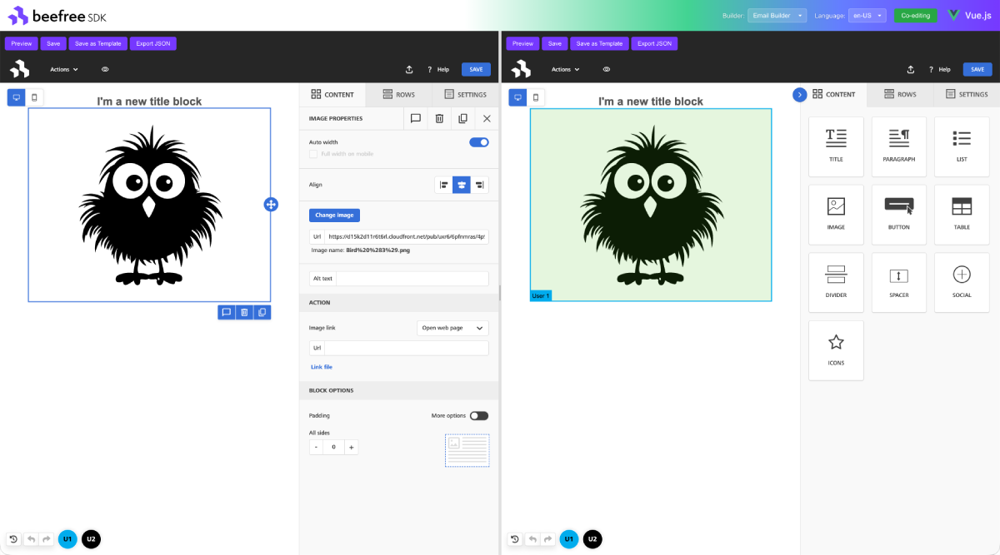

# Beefree SDK Vue.js Components

[](https://www.npmjs.com/package/@beefree.io/vue-email-builder)
[](https://opensource.org/licenses/Apache-2.0)
[](https://www.typescriptlang.org/)
[](https://vuejs.org/)

A Vue 3 wrapper for the [Beefree SDK](https://www.beefree.io/), providing components and composables to integrate the Beefree email, page, and popup builder into Vue.js applications.

<p align="center">
  
</p>

## Table of Contents

- [What is Beefree SDK?](#what-is-beefree-sdk)
- [Overview](#overview)
- [Compatibility](#compatibility)
- [Installation](#installation)
- [Quick Start](#quick-start)
- [API Reference](#api-reference)
- [Composable: useBuilder](#composable-usebuilder)
- [Best Practices](#best-practices)
- [Advanced Usage](#advanced-usage)
- [Examples](#examples)
- [FAQ](#faq)
- [Development](#development)
- [License](#license)

## What is Beefree SDK?

[Beefree SDK](https://www.beefree.io/) is a drag-and-drop visual content builder that lets your users design professional emails, landing pages, and popups — without writing code. It powers thousands of SaaS applications worldwide, offering a white-label, embeddable editing experience with real-time collaborative editing, responsive design output, and extensive customization options.

This Vue package provides `Builder` components and a `useBuilder` composable that handle SDK initialization, lifecycle management, and configuration updates — giving you a Vue-friendly API to integrate the full Beefree editing experience into your application.

## Overview

### Features

- **Simple Vue Integration** - Drop-in components with minimal setup
- **Composition API** - `useBuilder` composable for programmatic control
- **Dynamic Configuration** - Update builder configuration reactively
- **Collaborative Editing** - Support for shared/collaborative sessions
- **TypeScript Support** - Full TypeScript definitions included
- **Customizable** - Full access to Beefree SDK configuration options

## Compatibility

| Requirement | Version |
|-------------|---------|
| Vue         | >= 3.3 |
| Node.js     | >= 18.0.0 |
| TypeScript  | >= 4.7 (optional, but recommended) |
| Browsers    | Chrome, Firefox, Safari, Edge (latest 2 versions) |

## Installation

```bash
npm install @beefree.io/vue-email-builder
# or
yarn add @beefree.io/vue-email-builder
```

### Peer Dependencies

This package requires **Vue 3.3+** as a peer dependency:

```bash
npm install vue
```

## Quick Start

### 1. Get your credentials

Sign up at [developers.beefree.io](https://developers.beefree.io) to get your `client_id` and `client_secret`.

### 2. Set up token generation on your backend

Your backend server should exchange credentials for a short-lived token (see [Security: Server-Side Token Generation](#-security-server-side-token-generation) below for details):

```javascript
// Example: Node.js/Express backend endpoint
app.post('/api/beefree/token', async (req, res) => {
  const response = await fetch('https://auth.getbee.io/apiauth', {
    method: 'POST',
    headers: { 'Content-Type': 'application/json' },
    body: JSON.stringify({
      client_id: process.env.BEEFREE_CLIENT_ID,
      client_secret: process.env.BEEFREE_CLIENT_SECRET,
      grant_type: 'password',
    }),
  })
  res.json(await response.json())
})
```

### 3. Integrate the builder in your Vue app

```vue
<template>
  <div>
    <div>
      <button @click="preview()">Preview</button>
      <button @click="save()">Save</button>
    </div>
    <Builder
      v-if="token"
      :token="token"
      :config="config"
      @bb-save="onSave"
      @bb-error="onError"
    />
    <div v-else>Loading builder...</div>
  </div>
</template>

<script setup lang="ts">
import { ref, onMounted } from 'vue'
import { Builder, useBuilder } from '@beefree.io/vue-email-builder'
import type { IToken } from '@beefree.io/vue-email-builder'

const token = ref<IToken | null>(null)

const config = {
  uid: 'user-123',
  container: 'bee-container',
  language: 'en-US',
}

const { save, preview } = useBuilder(config)

onMounted(async () => {
  const res = await fetch('/api/beefree/token', { method: 'POST' })
  token.value = await res.json()
})

function onSave(args: [string, string, string | null, number, string | null]) {
  const [pageJson, pageHtml] = args
  console.log('Saved:', { pageJson, pageHtml })
}

function onError(error: unknown) {
  console.error('Builder error:', error)
}
</script>
```

## API Reference

### `Builder` Component

The component that wraps the Beefree SDK. Use it for email, page, popup, or file-manager flows by passing the appropriate token and config.

#### Props

| Prop        | Type                 | Default                               | Description                                |
|-------------|----------------------|---------------------------------------|--------------------------------------------|
| `token`     | `IToken`             | **required**                          | Authentication token from Beefree API      |
| `template`  | `IEntityContentJson` | `null`                                | Template JSON to load                      |
| `config`    | `IBeeConfig`         | `{ container: 'beefree-sdk-container' }` | SDK configuration                       |
| `width`     | `string`             | `'100%'`                              | Container width                            |
| `height`    | `string`             | `'100%'`                              | Container height                           |
| `shared`    | `boolean`            | `false`                               | Enable collaborative editing session       |
| `sessionId` | `string`             | `null`                                | Session ID to join (for collaborative editing) |
| `loaderUrl` | `string`             | `null`                                | Custom SDK loader URL                      |
| `bucketDir` | `string`             | `undefined`                           | Custom bucket directory                    |

#### Events

All events are prefixed with `bb-` (Beefree Builder) to avoid collisions with native DOM events:

| Event                          | SDK Callback                  | Payload                                                    |
|--------------------------------|-------------------------------|------------------------------------------------------------|
| `bb-save`                      | `onSave`                      | `[pageJson, pageHtml, ampHtml, templateVersion, language]` |
| `bb-save-as-template`          | `onSaveAsTemplate`            | `[pageJson, templateVersion]`                              |
| `bb-send`                      | `onSend`                      | `htmlFile`                                                 |
| `bb-error`                     | `onError`                     | `error`                                                    |
| `bb-warning`                   | `onWarning`                   | `warning`                                                  |
| `bb-load`                      | `onLoad`                      | `value`                                                    |
| `bb-change`                    | `onChange`                     | `[json, detail, version]`                                  |
| `bb-auto-save`                 | `onAutoSave`                  | `json`                                                     |
| `bb-start`                     | `onStart`                     | —                                                          |
| `bb-comment`                   | `onComment`                   | `[comment, action]`                                        |
| `bb-info`                      | `onInfo`                      | `info`                                                     |
| `bb-preview`                   | `onPreview`                   | `isOpen`                                                   |
| `bb-toggle-preview`            | `onTogglePreview`             | `isOpen`                                                   |
| `bb-preview-change`            | `onPreviewChange`             | `value`                                                    |
| `bb-save-row`                  | `onSaveRow`                   | `[rowJson, rowHtml, rowMeta]`                              |
| `bb-remote-change`             | `onRemoteChange`              | `[json, detail, version]`                                  |
| `bb-session-change`            | `onSessionChange`             | `value`                                                    |
| `bb-session-started`           | `onSessionStarted`            | `value`                                                    |
| `bb-template-language-change`  | `onTemplateLanguageChange`    | `{ label, value, isMain }`                                 |
| `bb-view-change`               | `onViewChange`                | `value`                                                    |
| `bb-load-workspace`            | `onLoadWorkspace`             | `value`                                                    |

### Handling Builder Events

Use Vue's native event system to react to builder events. All events use the `bb-` prefix:

```vue
<template>
  <Builder
    :token="token"
    :config="config"
    @bb-save="onSave"
    @bb-error="onError"
    @bb-session-started="onSessionStarted"
  />
</template>

<script setup lang="ts">
function onSave(args: [string, string, string | null, number, string | null]) {
  const [pageJson, pageHtml] = args
  console.log('Saved:', { pageJson, pageHtml })
}

function onError(error: unknown) {
  console.error('Builder error:', error)
}
</script>
```

> **Note for developers coming from React:** The `Builder` component also supports defining callbacks directly in the config object (e.g., `onSave`, `onError`). If both are provided, the config callback fires first, then the Vue event is emitted. While this works, the events-based approach shown above is the idiomatic Vue pattern and is recommended for new projects.

## Composable: `useBuilder`

The `useBuilder` composable provides programmatic control over a builder instance. It must be called at the top level of `<script setup>` (as with all Vue composables).

```vue
<script setup lang="ts">
import { useBuilder } from '@beefree.io/vue-email-builder'

const config = {
  container: 'bee-editor',
  uid: 'user-123',
  language: 'en-US',
}

const {
  save,
  load,
  preview,
  togglePreview,
  updateConfig,
  getTemplateJson,
  switchTemplateLanguage,
} = useBuilder(config)

async function changeLanguage(lang: string) {
  await updateConfig({ language: lang })
}
</script>
```

### How It Works

The composable connects to the builder instance through the `container` ID:

1. You call `useBuilder(config)` with a config that includes a `container` ID.
2. When a `Builder` component with a matching container mounts, the composable automatically binds to its SDK instance.
3. Methods like `save()` and `preview()` delegate to the live SDK instance via closures — reactivity is maintained without `computed` wrappers.
4. When the component unmounts, the composable cleans up its config registry entry.

### Available Methods

| Method                            | Description                              |
|-----------------------------------|------------------------------------------|
| `updateConfig(partial)`           | Updates builder configuration dynamically |
| `save(options?)`                  | Triggers save action                     |
| `saveAsTemplate()`                | Saves as template                        |
| `send(args?)`                     | Sends the email                          |
| `load(template)`                  | Loads a template JSON                    |
| `reload(template, options?)`      | Reloads without loading dialog           |
| `preview()`                       | Opens preview                            |
| `togglePreview()`                 | Toggles preview                          |
| `switchPreview(args?)`            | Switches preview language                |
| `toggleComments()`                | Toggles comments panel                   |
| `toggleStructure()`               | Toggles structure outlines               |
| `toggleMergeTagsPreview()`        | Toggles merge tag preview                |
| `switchTemplateLanguage(args)`    | Switches content language                |
| `getTemplateJson()`               | Returns template JSON                    |
| `getConfig()`                     | Returns current config                   |
| `loadConfig(args, options?)`      | Loads new config                         |
| `loadStageMode(args)`             | Loads stage mode                         |
| `loadWorkspace(type)`             | Loads workspace                          |
| `loadRows()`                      | Loads rows                               |
| `showComment(comment)`            | Shows a comment                          |
| `updateToken(token)`              | Updates auth token                       |
| `execCommand(command, options?)`  | Executes editor command                  |
| `startFileManager(config, ...)`   | Starts file manager                      |
| `join(config, sessionId, ...)`    | Joins shared session                     |
| `start(config, template, ...)`    | Starts builder                           |

## Best Practices

### 🔒 Security: Server-Side Token Generation

**⚠️ CRITICAL:** Never expose your Beefree API credentials in frontend code!

**❌ Bad (Insecure):**

```typescript
// DON'T DO THIS!
const token = await fetch('https://auth.getbee.io/loginV2', {
  method: 'POST',
  body: JSON.stringify({
    client_id: 'your-client-id',      // ❌ Exposed!
    client_secret: 'your-secret',      // ❌ Exposed!
  })
})
```

**✅ Good (Secure):**

1. **Backend API endpoint** (Node.js/Express example):

```javascript
// backend/routes/auth.js
app.post('/api/beefree/token', async (req, res) => {
  const response = await fetch('https://auth.getbee.io/apiauth', {
    method: 'POST',
    headers: { 'Content-Type': 'application/json' },
    body: JSON.stringify({
      client_id: process.env.BEEFREE_CLIENT_ID,
      client_secret: process.env.BEEFREE_CLIENT_SECRET,
      uid: req.user.id
    })
  })

  const token = await response.json()
  res.json(token)
})
```

2. **Frontend:**

```vue
<script setup lang="ts">
import { ref, onMounted } from 'vue'
import type { IToken } from '@beefree.io/vue-email-builder'

const token = ref<IToken | null>(null)

onMounted(async () => {
  const response = await fetch('/api/beefree/token', {
    method: 'POST',
    credentials: 'include',
  })
  token.value = await response.json()
})
</script>
```

### 🎯 Unique Container IDs

When using multiple builders on the same page, ensure unique `container` IDs:

```vue
<script setup lang="ts">
const builder1 = useBuilder({ container: 'builder-1', uid: 'user-1' })
const builder2 = useBuilder({ container: 'builder-2', uid: 'user-2' })
</script>
```

### 📝 Reactive Configuration

Use `reactive()` for configs that need runtime updates (e.g., language switching). The `Builder` component deep-watches its config prop and syncs callbacks automatically:

```vue
<script setup lang="ts">
import { reactive } from 'vue'

const config = reactive({
  uid: 'user-123',
  container: 'bee-editor',
  language: 'en-US',
  onSave: (json: string, html: string) => {
    console.log('Saved:', { json, html })
  },
})

function changeLanguage(lang: string) {
  config.language = lang
}
</script>
```

### 🔄 Collaborative Editing

For collaborative sessions, share the `sessionId` between users:

```vue
<template>
  <!-- Host creates the session -->
  <Builder
    :token="token"
    :config="hostConfig"
    :shared="true"
    @bb-session-started="onSessionStarted"
  />

  <!-- Guest joins with sessionId -->
  <Builder
    v-if="sessionId && guestToken"
    :token="guestToken"
    :config="guestConfig"
    :shared="true"
    :session-id="sessionId"
  />
</template>

<script setup lang="ts">
import { ref } from 'vue'

const sessionId = ref<string | null>(null)

function onSessionStarted(event: { sessionId?: string }) {
  if (event?.sessionId) {
    sessionId.value = event.sessionId
  }
}
</script>
```

## Advanced Usage

### Custom Content Dialogs

```typescript
const config = {
  contentDialog: {
    saveRow: {
      label: 'Save to Library',
      handler: async (resolve) => {
        const rowName = await showCustomDialog()
        resolve({ name: rowName })
      }
    },
    addOn: {
      handler: async (resolve) => {
        const content = await fetchCustomContent()
        resolve(content)
      }
    }
  }
}
```

### External Content Sources

```typescript
const config = {
  rowsConfiguration: {
    externalContentURLs: [
      {
        name: 'My Saved Rows',
        handle: 'saved-rows',
        isLocal: true
      }
    ]
  },
  hooks: {
    getRows: {
      handler: async (resolve, reject, args) => {
        if (args.handle === 'saved-rows') {
          const rows = await fetchSavedRows()
          resolve(rows)
        } else {
          reject('Handle not found')
        }
      }
    }
  }
}
```

### Mentions/Merge Tags

```typescript
const config = {
  hooks: {
    getMentions: {
      handler: async (resolve) => {
        const mentions = [
          { username: 'FirstName', value: '{{firstName}}', uid: 'fn' },
          { username: 'LastName', value: '{{lastName}}', uid: 'ln' }
        ]
        resolve(mentions)
      }
    }
  }
}
```

## Examples

The [`/example`](example/) directory contains a fully working application that demonstrates:

- Token authentication flow
- Collaborative editing with template preservation
- Save, preview, and export functionality
- Multi-language UI switching
- Different builder modes (email, page, popup, file manager) via config
- Per-instance control bars in co-editing mode
- Keyboard-accessible split divider with ARIA attributes
- Reusable toast notification system

**Quick start:**

```bash
cd example
cp .env.sample .env   # Fill in your Beefree credentials
cd ..
yarn install
yarn start            # Opens at http://localhost:5173
```

## FAQ

### How do I authenticate with the Beefree SDK?

Authentication requires a `client_id` and `client_secret`, which you get by signing up at [developers.beefree.io](https://developers.beefree.io). These credentials should **never** be exposed in frontend code. Instead, create a backend endpoint that exchanges them for a short-lived token and pass that token to the `Builder` component. See [Security: Server-Side Token Generation](#-security-server-side-token-generation) for a complete example.

### Can I use this with Nuxt, Vite, or other Vue frameworks?

Yes. This package works with any Vue 3-based framework. For **Nuxt 3**, wrap the builder in a `<ClientOnly>` component since the SDK requires the DOM. For **Vite**, it works out of the box. For **Quasar** or other Vue 3 frameworks, use them as you would any Vue component.

### Does it support collaborative editing?

Yes. Set `:shared="true"` on the `Builder` component to create a collaborative session. The `bb-session-started` event provides a `sessionId` that other users can use to join the same session. See [Collaborative Editing](#-collaborative-editing) for a full example.

### What email clients are supported?

The Beefree SDK generates responsive HTML that is compatible with all major email clients, including Gmail, Outlook (desktop and web), Apple Mail, Yahoo Mail, and mobile email apps. The output follows email HTML best practices with inline CSS and table-based layouts for maximum compatibility.

### Can I customize the builder UI?

Yes. The Beefree SDK supports extensive UI customization including custom content dialogs, external content sources, merge tags, special links, and more. See [Advanced Usage](#advanced-usage) and the [Beefree SDK Documentation](https://docs.beefree.io/) for the full range of customization options.

### How do I load an existing template?

Pass your template JSON to the `:template` prop of the `Builder` component. You can also use the `load` method from the `useBuilder` composable to programmatically load a template at any time after initialization.

### Can I use the Options API instead of `<script setup>`?

The `useBuilder` composable must be called within a Vue setup context (either `<script setup>` or inside the `setup()` function). The components themselves work with both the Options API and the Composition API.

## Development

### Prerequisites

- Node.js >= 18 (see `.nvmrc`)
- Yarn 4

### Setup

```bash
# Install dependencies
yarn install

# Start the example dev server
yarn start

# Run tests
yarn test

# Run tests once (CI)
yarn test:ci

# Lint
yarn lint

# Build library
yarn build
```

### Building

```bash
yarn build
```

The library build uses **Vite library mode** (`vite.lib.config.ts`) and generates ESM, CJS, and DTS outputs.

Outputs:
- `dist/index.js` - CommonJS bundle
- `dist/index.es.js` - ES module bundle
- `dist/index.d.ts` - TypeScript definitions

### Project Structure

```
src/                      # Library source
  components/             # Vue components (Builder + convenience aliases)
  composables/            # Vue composables (useBuilder, useRegistry)
  types.ts                # TypeScript types
  constants.ts            # Constants
  index.ts                # Public API exports
  __tests__/              # Test files

example/                  # Example application (Vite dev server)
  App.vue                 # Root component with toast system
  BeefreeExample.vue      # Demo component with co-editing
  beefree-token.ts        # Token service (demo only)
  environment.ts          # Environment config
  i18n/                   # Localization files (22 languages)
```

### Environment Variables

Copy `example/.env.sample` to `example/.env` and fill in your Beefree SDK credentials:

```
VITE_EMAIL_BUILDER_CLIENT_ID=your-client-id
VITE_EMAIL_BUILDER_CLIENT_SECRET=your-client-secret
```

## Troubleshooting

### Builder not loading

1. Verify token is valid and not expired
2. Check the browser console for errors
3. Ensure `container` ID is unique on the page
4. Confirm `uid` is set in the config

### Builder not responding to `useBuilder` methods

The `container` ID in your `useBuilder` config must match the `container` in the `Builder` component's config. The composable binds to the SDK instance by container ID.

## License

[Apache License 2.0](LICENSE)

## Support

For issues related to:
- **This Vue wrapper**: Open an issue on [this repository](https://github.com/BeefreeSDK/vue-email-builder/issues)
- **Beefree SDK**: Visit [Beefree Developer Documentation](https://docs.beefree.io/)
- **Account/billing**: Contact [Beefree Support](https://www.beefree.io/support/)

## Resources

- [Beefree SDK Documentation](https://docs.beefree.io/)
- [Beefree API Reference](https://docs.beefree.io/beefree-sdk/apis)
- [Examples and Guides](https://github.com/BeefreeSDK/beefree-sdk-examples)
